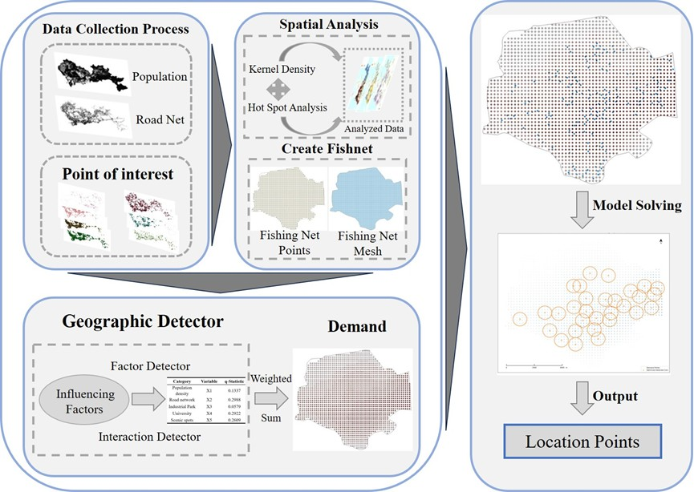
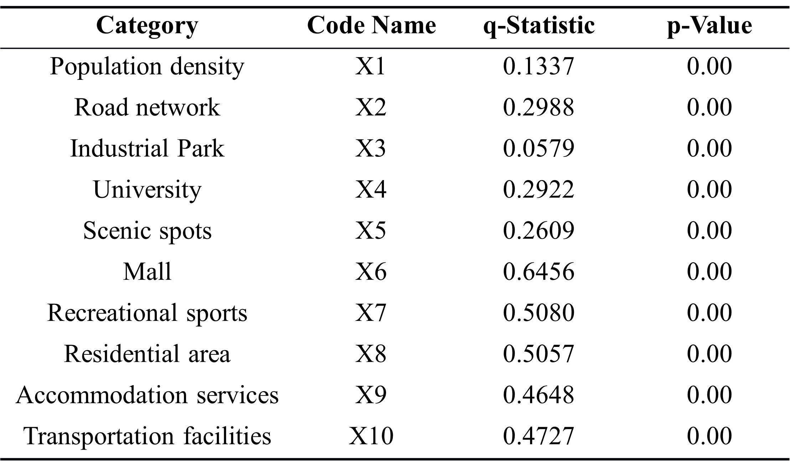
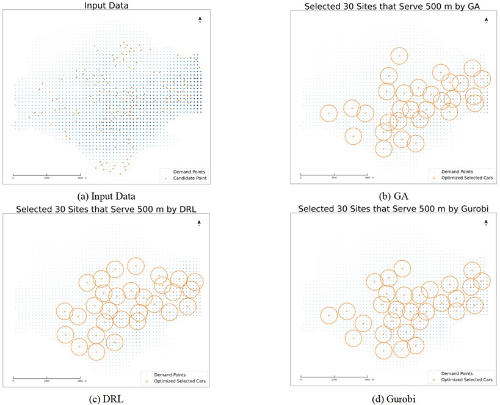

# Optimization-of-Site-Selection-for-FFEV-Based-on-DRL

---

As a modern mode of medium- and long-distance transportation, the widespread adoption of free-floating shared electric vehicles (FFSEVs) could reduce urban carbon emissions and ease traffic congestion. However, this mode of transportation also faces challenges such as unregulated parking and imbalance between supply and demand. This study proposes a spatial optimization method for the deployment of free-floating shared electric vehicles. The study employs data sources such as population, points of interest, and public parking lots in Shenzhen, and uses spatial analysis methods to explore the spatial distribution relationship between public parking lots and influencing factors. Combined with the spatial distribution characteristics, a maximum coverage positioning model is established, and the optimization results are obtained by solving the model using a deep reinforcement learning algorithm. By comparing the efficacy of the traditional algorithm with the deep reinforcement learning algorithm (DRL), the superiority of the latter in solving the location model is demonstrated. This study proposes a new method to optimize the planning and allocation of shared transportation in Shenzhen, which provides a valuable reference for the location of other facilities.

## Study Area
Shenzhen is a modern city in China that has been significantly affected by the reform and opening-up policy. It has experienced a period of rapid economic development and is one of China's Special Economic Zones, which serves as an international comprehensive transportation hub. The population of Shenzhen is highly mobile, particularly in the city center and commercial areas such as Futian District and Luohu District. This places significant demands on the transportation system. The majority of commuters rely on the metro and bus systems, yet congestion during peak hours persists as a significant challenge that requires immediate attention. The optimization of the allocation of shared electric vehicles can significantly alleviate traffic pressure and serve as a model for shared transportation planning in similar cities.

  

## Data Sources
The public parking lot data is sourced from the Gaode API open platform, with a cutoff date of May 30, 2024. The dataset includes facility names, facility addresses, latitude and longitude coordinates, and public parking lot IDs, totaling 5,992 records.

Analyzing Points of Interest(POI) helps to understand the economic development, tourism resources, transportation facilities, and other related aspects of an area. All this data is sourced from the Gaode API open platform.

The distribution of the transportation network directly affects the smoothness of traffic flow and the choice of travel routes, while the density of the transportation network directly impacts the convenience of travel, thus influencing the distribution of parking demand. The road network data for Shenzhen is sourced from 
the GLOBIO GRIP Global Road Database.

Analyzing Points of Interest(POI) helps to understand the economic development, tourism resources, transportation facilities, and other related aspects of an area. All this data is sourced from the Gaode API open platform.

## Method
Due to the constraints imposed by the limitations in equipment conditions and data availability, this study selects Futian District in Shenzhen, which is characterized by a high population density, high mobility, and a dense transportation network, as the study area. The district is divided into 200×200 grid cells, with the center point of each grid cell designated as the demand point for the area. In order to evaluate the demand of a region, it is necessary to consider the influence of its surrounding environment in a comprehensive manner.

As the deployment area of free-floating shared electric vehicles includes public parking lots, this study employs kernel density analysis and hot spot analysis to explore the spatial relationships between population, transportation networks, POIs, and public parking lots. Geographic detectors are employed to calculate the influence weight of each factor on public parking lots.

First, kernel density analysis is conducted for each influencing factor, and the values are extracted to the demand points. Subsequently, geographic detectors are employed to calculate the influence weight of each factor, and a weighted sum is performed to obtain the demand for each demand point. Finally, a maximal coverage model is established, and deep reinforcement learning is employed to solve the model, resulting in the final optimized results. The results are then compared with the efficiency and coverage of traditional algorithms. 

## EXPERIMENTS AND ANALYSIS
### Spatial Distribution 
The spatial analysis of the parking lot dataset shows that most of the public parking lots are concentrated in the Shenzhen-Hong Kong Innovation and Cooperation Zone in Futian District, the Convention and Exhibition Ocean City in Bao'an District, the Comprehensive Innovation Core Zone formed by Bao'an District and Nanshan District together, and the Guangming Science City in Guangming District. The remaining parking lots are distributed in the high-tech industrial parks in each district. All of these areas are located in the city center and are characterized by a well-developed economy, convenient urban transportation and dense population.

  

###  Hot Spot Analysis
A hotspot analysis of Shenzhen's road network reveals that the hotspot areas are distributed in the eastern and southeastern coastal areas of Bao'an District and extend to the central part of Longgang District. These areas are connected to Nanshan District and Futian District. Other notable hotspot areas are located in Longhua District. Cold spot areas are located in Dapeng New District, Pengshan District, southwestern Longgang District, northwestern Guangming District, and northern Bao'an District. The areas with higher parking lot densities overlap significantly with the hotspot areas with higher road densities.

  

### Kernel density Analysis
A spatial overlay of parking lot distribution and population density was used to reflect the relationship. Areas with high population kernel density values show a high correlation with areas with high parking lot values. As shown in the figure, the above areas are mainly located in Futian District, the southwest of Luohu District, the north-central area of Bao'an District, and the Comprehensive Innovation Core Area consisting of the southern part of Bao'an District and Nanshan District. These areas are home to a large number of high-tech and innovative companies, as well as numerous high-end residential communities. In addition, these areas offer a wide range of living and recreational facilities and have a rich cultural and educational infrastructure.

  

### Geographic Detector
The main functions of the geodetector cover factor detection, interaction detection, risk detection and ecological detection. Both factor detection and interaction detection were used in this study, aiming to assess the explanatory strength of each influencing factor on the dependent variable and to explore how the interaction between different factors affects this dependent variable. The number of public parking lots was set as the dependent variable, while the values of various factors that may affect its number were used as independent variables, as a way to analyze in depth the explanatory power of these independent variables on the number of public parking lots and their importance. The results are shown below. The interaction detector shows generalized enhancement among all factors. This indicates that the distribution of parking lots is influenced by the interaction of several factors rather than being controlled by a single factor only. In particular, there is a significant correlation between universities (X4) and residential areas (X8), the latter also being correlated with shopping malls (X6) and transportation (X10). There is also a significant correlation between scenic areas (X5) and shopping centers (X6). On the contrary, relatively weak interactions were found between population density (X1) and industrial parks (X3) and between population density (X1) and road network (X2). Significant positive effects were found between the remaining factors.

  

  

### Location Optimization
Due to the limitations of the existing equipment and model size, the demand points are selected as the center of the 200 × 200 m grid points in Futian District, with a total of 1,797 demand points as well as 159 facility points. In this study, deep reinforcement learning is used to solve the MCLP model, and 30 free-floating shared electric vehicle deployment areas are identified, each with a service radius of 500 meters.

This study also compares the solution time, amount of coverage and coverage of the traditional algorithms, i.e., Genetic Algorithm (GA) and Gurobi solver, with Deep Reinforcement Learning (DRL) as shown in Figure 6 and Table 2. It can be seen that Gurobi achieves the best coverage amount and coverage rate, thus providing the optimal solution for the maximum coverage model. Although the coverage of DRL is slightly lower than that of Gurobi, it is higher than that of GA.In terms of solution time, Gurobi takes 37 times longer than DRL, while GA takes 7.7 times longer than DRL. This indicates that DRL is more efficient in site optimization and produces better solutions.

  

  

